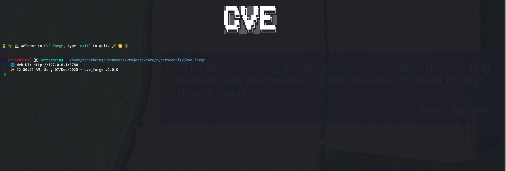
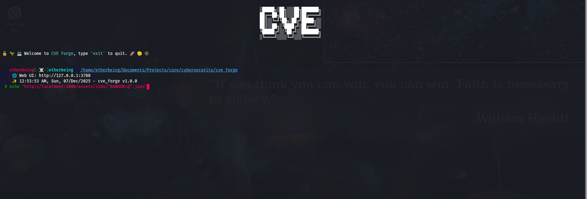

# etherbeing: Esteban Chacon Martin

I'm a pentester and software developer with several years of experience on automation software, scrapping, sniffing, fullstack web services, linux administration, packet crafting, alternative neural network research and more. I'm enthusiast about cybersecurity and AI while cybersecurity (pentesting) is my main focus, right now my aspirations towards my career are to both finish my [EGO](https://github.com/etherbeing/ego) Neural Network and see it alive as well as seeing the [CVE Forge](https://github.com/etherbeing/cveforge) an standard on the pentesting industry.
Among my other passions there are game development, general research inside and outside software and computer science, philosophy, human rights, politics, mathematics, and asian culture (mainly japan and south korea).

## Projects

1. **CVE Forge**: [Github](https://github.com/etherbeing/cveforge) An actionable framework for penetration testing. Uses scapy,beautiful soup, asyncio, rich, prompt_toolkit, multithreading, multiprocessing, watchdog, fuzzers, scrappers and more...
2. **EGO: Human Like Analysis**: [Github](https://github.com/etherbeing/ego) Biological inspired Neural Network (Not released yet, ETA: 2 to 3 years). Developed purely on Rust + cargo with no external deps.
3. **etherbeing: Personal Website**: [Github](https://github.com/etherbeing/etherbeing) Github Pages personal website, developed with Astro.js
4. **automation**: [Github](https://github.com/etherbeing/automation) Django and other related django libraries.
5. **unfold**: [Github](https://github.com/etherbeing/unfold/) Full stack website using Rust for the backend powered by sqlx, Actix Web and other Rust crates and for the frontend Svelte is been used.
6. **devops**: [Github](https://github.com/etherbeing/devops/) Docker files for standard docker deployment
7. **senjor**: [Github](https://github.com/etherbeing/senjor/) A library for building graphql APIs by using just the models, dropped after found [strawberries](https://strawberry.rocks/docs/integrations/django)
8. **recaptchav3**: [Github](https://github.com/etherbeing/recaptchav3/) Code snippet for implementing recaptchav3 quickly in Django + DRF using standard permissions.
9. **demomanager**: [Github](https://github.com/etherbeing/demomanager/) Code snippet to load demo data into django using Faker library.
10. **smoothlify**: [Github](https://github.com/etherbeing/smoothlify/) Library to allow and quickly create asynchronous or non blocking requests to the server without needing to manually do the fetch requests.
11. **sly**: [Github](https://github.com/etherbeing/sly_browser/) This is my first programming language through it wasn't ended as today (golang came first) it was aimed like astro or qwik to by using imports fetching on demand the imported modules... That's why is called network oriented programming language, but as the world advance faster new technologies emerged that did similar and sometimes better. Another programming language idea came (but then als Rust came).
12. **powerhouse**: [Github](https://github.com/etherbeing/powerhouse) Programming language written on Rust inspired in python and focused on today tasks like file access and device drivers.
13. **django-translator**: [Github](https://github.com/etherbeing/django_translator/) Django library for translating content using the google translator package.
14. **cryptopass**: [Github](https://github.com/etherbeing/cryptopass/) Crypto tracker written in javascript
15. **CryptoTracker**: [Github](https://github.com/etherbeing/CryptoTracker/) Crypto tracker written in python
16. **TFProtocol Java Client**: [Github](https://github.com/etherbeing/tfprotocol) Communication protocol in L4 (IP/TCP and IP/UDP) with custom cryptography and more.

## Relevant Links

* [HackerOne profile](https://hackerone.com/real_etherbeing?type=user)
* [Bugcrowd profile](https://bugcrowd.com/h/etherbeing99)
* [TryHackMe](https://tryhackme.com/p/etherbeing)
* HackTheBox etherbeing99
* [Github](https://github.com/etherbeing)
* [Website](https://etherbeing.github.io)

## Gallery
Collections of images of either released or developed software
### CVE Forge
1. Main view or initial view plus banner

2. Using an echo command alongside with a fuzzer that prints a message with each value the fuzzer obtained

